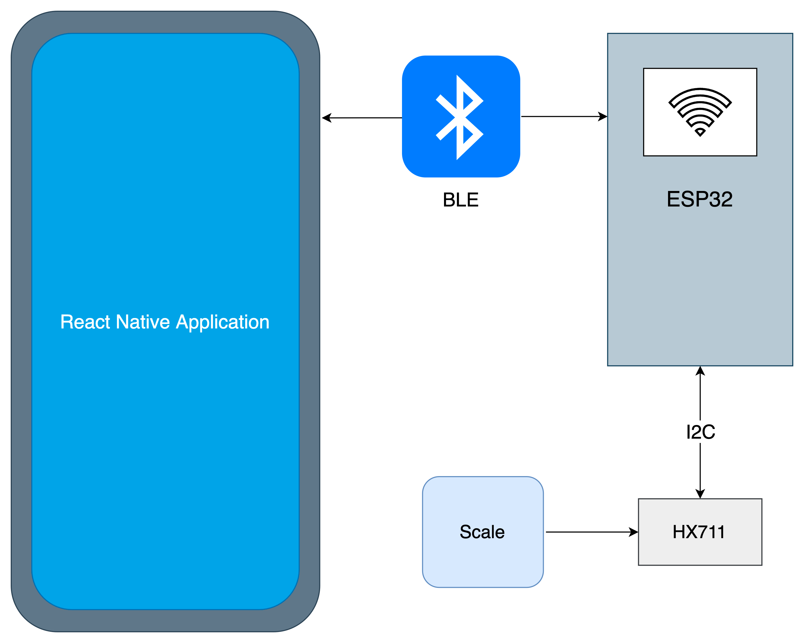
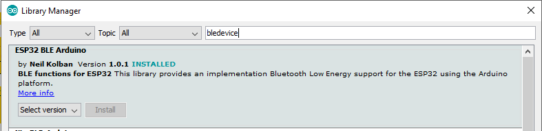
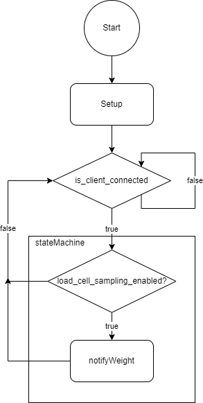
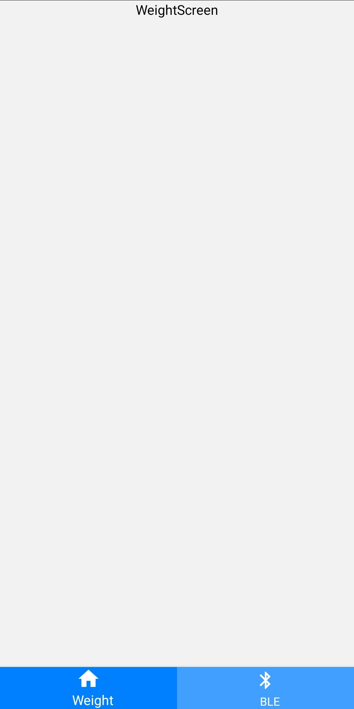
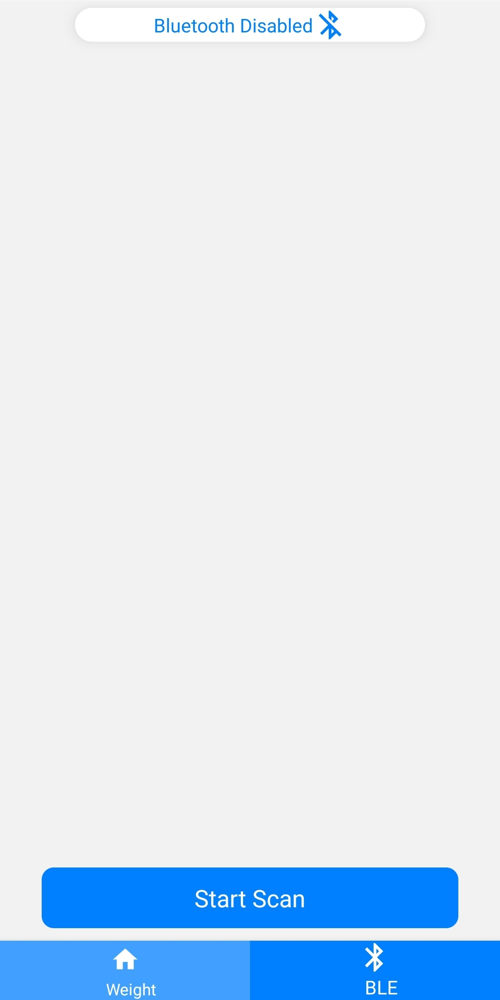
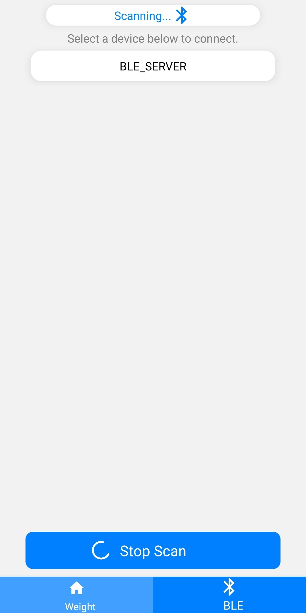
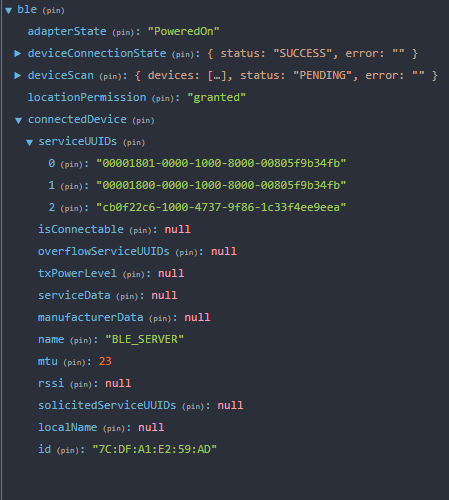
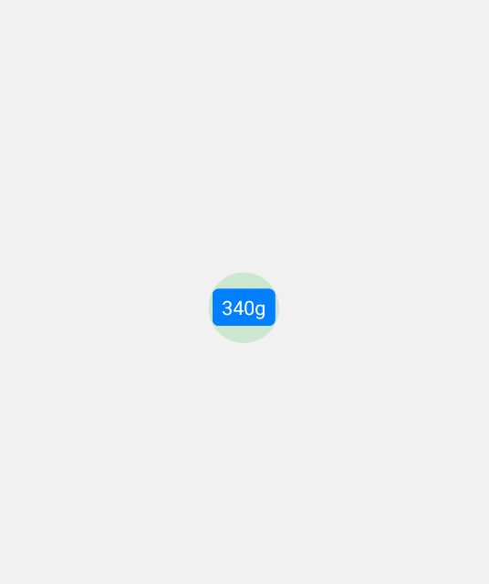

# Building a live data feed BLE application with React Native and ESP32
## Overview
Getting started with a BLE project and don’t know where to start? Search no further.
In this code-along tutorial we will be developing a simple, yet thorough, BLE project
that will teach you everything you need to know in order to get started on your own
BLE projects with minimal effort. While keeping things simple and to the point, this 
guide aims to apply best practices, ensuring you can easily scale and build upon what
you have learnt.

In this guide, we will be using an ESP32 microcontroller connected to an HX711 load cell
amplifier to collect our live data - however any other type of sensor can be used with 
minimal code adjustments. You can even do this tutorial without any external sensor and 
simply sample values from the ADC. For the mobile application, we will be using React 
Native (with TypeScript) and the [react-native-ble-plx](https://dotintent.github.io/react-native-ble-plx/) 
library for bluetooth integration. A link to the GitHub repo containing the final React Native code and
C++ firmware is provided at the end of this article.

## Requirements
This guide will be kept as generic as possible to ensure that you can easily swap 
out components with whatever your project requirements are. The following components
are used in this guide:
- ESP32-S3 (or any other BLE enabled MCU supported by the Arduino framework)
- Physical Android or iOS device (simulators are not supported)
- HX711 load cell amplifier with a load sensor (Optional)

## System Architecture
A high level system architecture diagram is shown below. The diagram consists of a 
physical mobile device running our React Native application, connected to the ESP32 via 
a BLE connection. The ESP32 is connected to our load cell amplifier via an I2C connection
to sample our data and stream the samples to our application in real time.



## ESP32 Bluetooth Server
To start this project, we will write the firmware for our BLE server. Because this guide
is intended to be generic, I will not go into too much detail regarding the sensor used
(HX711 load cell amplifier). The focus will be on the implementation of the BLE server.
Feel free to use any other sensor you have available. Alternatively, you can also simply
sample the ADC input if you do not have other sensors available.

### BLE Theory
If this is your first BLE project I highly recommend learning some basic theoretical concepts
of BLE and how it works. A basic understanding of BLE theory will greatly assist you when 
following this guide. There are many BLE learning resources available, depending on which
level of depth you want to learn. For the purposes of this guide the 
[Introduction to Bluetooth Low Energy](https://learn.adafruit.com/introduction-to-bluetooth-low-energy?view=all)
post by Adafruit should give you enough insight. I also highly recommend the 
[BLE C++ Guide](https://github.com/nkolban/esp32-snippets/blob/master/Documentation/BLE%20C%2B%2B%20Guide.pdf)
by Neil Kolban, the author of the library we will be using. This guide will give some
more insights into the BLE implementation from a firmware perspective, as it will be done in this
guide.

### Step 1: Hardware Setup
For a detailed guide on setting up the load cells, please refer to the
[Load Cell Amplifier HX711 Breakout Hookup Guide](https://learn.sparkfun.com/tutorials/load-cell-amplifier-hx711-breakout-hookup-guide)
provided by SparkFun. The only particular thing to note for this guide is that the
HX711 'CLK' and 'DAT' pins will be connected to GPIO pins 4 and 5 respectively.
Feel free to use any other suitable pin and change the pin numbers in the upcoming code 
accordingly.

### Step 2: IDE Setup and Libraries
For simplicity, the firmware is implemented in the Arduino IDE. However, you may use any
IDE of your choice. The firmware has also been successfully implemented in PlatformIO.
The external libraries required for this project, other than the HX711 library used in the
load cell guide linked earlier, is the [ESP32 BLE Arduino](https://github.com/nkolban/ESP32_BLE_Arduino)
library by Neil Kolban. To use this library, in the Arduino IDE, select *Tools -> Manage Libraries...*
and search for *bledevice*. Then install the library by Neil Kolban:



### Step 3: Firmware

In the Arduino IDE create a new project: *ble-firmware.ino* (or *ble-firmware.cpp* for PlatformIO) and 
include the required libraries:

```
//=========================
// Libraries
//=========================
#include <Arduino.h>
#include <Arduino.h>
#include <BLEDevice.h>
#include <BLEUtils.h>
#include <BLEServer.h>
#include <HX711.h>
#include <Wire.h>
```

Our BLE server will only be transmitting weight data, therefore only 1 BLE service is required, the 
'SAMPLE_SERVICE', which relates to our sampling data. The only data we are sampling is a weight 
measurement. Therefore, we only have a single characteristic for our sampling service - the load
cell sampling characteristic 'SAMPLE_LOAD_CELLS'. You can use an online 
[UUID generation tool](https://www.uuidgenerator.net/) to generate any two UUID values for the 
service and characteristic. In this guide we will use the following values, which you can add to your
code if you're following along, below the libraries:

```
// ...
//=========================
// Compiler Constants
//=========================
// SAMPLE Service
#define SAMPLE_SERVICE_UUID "cb0f22c6-1000-4737-9f86-1c33f4ee9eea"
#define SAMPLE_LOAD_CELLS_CHARACTERISTIC_UUID "cb0f22c6-1001-41a0-93d4-9025f8b5eafe"
```

Next, we define some global variables (refer to the code comments for clarity):
```
// ...
//=========================
// Device Instantiations
//=========================
// HX711 Load Cell Amplifier
HX711 scale;

//=========================
// Global Variables
//=========================
float calibration_factor = -24000; // Follow the SparkFun guide to get this value
bool client_is_connected = false; // Only sample when a client is connected
// Load Cell Amplifier Pins. You can change this to match your setup
const int HX711_DOUT = GPIO_NUM_5;
const int HX711_CLK = GPIO_NUM_4;
// BLE Server
BLEServer *pServer; 
// Characteristics: Load Cells
BLECharacteristic *loadCellCharacteristic;

//=========================
// State Machine Flags
//=========================
bool load_cell_sampling_enabled = false; // Only sample the load cells if a client requested
```

To optimize power usage and performance, we define some flags which we will use in a 
finite state machine in our loop code. For example, we use the `client_is_connected` 
flag to track when a client connects/disconnects. When no client is connected the device
should remain in an idle state. When a client connects and requests notifications
on our load cell sampling service the `load_cell_sampling_enabled` flag is enabled,
indicating to our state machine that the load cell amplifier should be sampled and
the BLE notifications should be triggered.

The operation of the BLE server is perhaps best expressed visually,
using a high level finite state machine (FSM) diagram:



Now, some configuration/setup is required to get everything working.
Let's start with the BLE server. We need to initialize the BLE server on our device
with a server name, create the server and then define a basic server callback which
is triggered whenever a device connects and disconnects to our server:

```
void setupBLEServer(void)
{
  BLEDevice::init("BLE_SERVER"); // Initialize server with a name
  pServer = BLEDevice::createServer();
  pServer->setCallbacks(new BaseBLEServerCallbacks());
}
```

We write the callback function for the server events by extending the base
`BLEServerCallbacks` class provided by the BLE library:

```
class BaseBLEServerCallbacks : public BLEServerCallbacks
// Callback triggered when a client device connects or disconnects
{
  void onConnect(BLEServer *pServer)
  {
    client_is_connected = true;
    Serial.println("Device connected");
  }

  void onDisconnect(BLEServer *pServer)
  {
    client_is_connected = false;
    Serial.println("Device disconnected");
    // Restart advertising
    pServer->getAdvertising()->start();
  }
};
```

As seen in the code, the `client_is_connected` flag is toggled depending on device
connection status using this callback.

With our server initiated, we can define the services and characteristics. We require 
only a single sampling service containing the load cell sampling characteristic. The 
characteristic will have a 'read' property (for manually requesting samples) as well as
a 'notify' property which is used to provide realtime samples to the app. Whenever
the 'notify' property is used, it is also important to assign a 'Client Characteristic 
Configuration Descriptor' (CCCD) to that characteristic. The CCCD is an unsigned integer
value which, amongst other things, is used to determine whether a client is subscribed
to a notifier. We will later use this descriptor value to toggle load cell sampling.

```
void setupSampleService(void)
{
  BLEService *sampleService = pServer->createService(SAMPLE_SERVICE_UUID);

  // Weight/Load Cell Sample Characteristic
  loadCellCharacteristic = sampleService->createCharacteristic(
      SAMPLE_LOAD_CELLS_CHARACTERISTIC_UUID,
      BLECharacteristic::PROPERTY_READ |
          BLECharacteristic::PROPERTY_NOTIFY);
  loadCellCharacteristic->setCallbacks(new SampleLoadCellCallback());
  loadCellCharacteristic->setValue("PENDING");

  // -- create CCC descriptors for notification service and listener callbacks --
  BLEDescriptor *pLoadCellCCCDescriptor = new BLEDescriptor((uint16_t)0x2902);
  pLoadCellCCCDescriptor->setCallbacks(new LoadCellDescriptorCallback());
  loadCellCharacteristic->addDescriptor(pLoadCellCCCDescriptor);

  sampleService->start();
}
```

The `SampleLoadCellCallback` is triggered whenever we want to make a single weight
sampling request manually and simply updates the characteristic with the weight value:


```
class SampleLoadCellCallback : public BLECharacteristicCallbacks
{
  void onRead(BLECharacteristic *pCharacteristic)
  {
    float weight = scale.get_units();
    pCharacteristic->setValue(weight);
  }
};

```

The final step in setting up our BLE server is to set up and start the advertising.
We will not be setting any custom advertisement data, but feel free to add some
advertisement data to your own project:

```
void setupAdvertisementData(void)
{
  BLEAdvertising *pAdvertising = pServer->getAdvertising();
  BLEAdvertisementData advertisementData;
  // Set properties of advertisement data
  pAdvertising->setAdvertisementData(advertisementData);
  pAdvertising->start();
}
```

Our Bluetooth scale setup is almost complete! We just need to set up the scale:

```
void setupLoadCells(void)
{
  pinMode(HX711_CLK, OUTPUT);
  pinMode(HX711_DOUT, INPUT);

  scale.begin(HX711_DOUT, HX711_CLK);
  scale.set_scale(calibration_factor);
  scale.tare(); // Reset the scale to 0
}
```

That's it! To wrap it up, we place the setup calls in the `setup()` function
provided by the Arduino template:

```
void setup()
{
  // Setup USB Serial
  Serial.begin(115200);

  // Setup HX711 and Load Cells
  Serial.println("--Setting up HX711--");
  setupLoadCells();

  // Setup BLE
  Serial.println("--Setting up BLE Server--");
  setupBLEServer();
  setupSampleService();
  setupAdvertisementData();

  Serial.println("--Setup Complete--");
}
```

With reference to the FSM diagram shown earlier, we can implement the `loop()`
function as a **very** simple FSM:

```
void loop()
{
  if (client_is_connected)
  // Do nothing if no client is connected
  {
    stateMachine();
  }
}

void stateMachine(void)
{
  if (load_cell_sampling_enabled)
  {
    notifyWeight();
  }
}
```

The `notifyWeight()` function simply samples the weight sensor and updates the BLE
notifier with the latest sample value:

```
void notifyWeight(void)
{
  float weight = scale.get_units(5);
  loadCellCharacteristic->setValue(weight);
  loadCellCharacteristic->notify();
}
```

Using this modular FSM architecture we can easily add new functionality or 
sensors in future iterations.

That is our entire BLE firmware done. For the full code example refer to the GitHub project
linked at the end of this guide.

## React Native Application
Now that we have our basic BLE server running, let's build our client React application.
For this project, we will be using Expo to manage our application. 

### Step 1: Initialize the project
To get started, create a new folder for the project and name it *ble-react-native*. You may
also use an alternative name if you wish.
Within this new folder, open a terminal or command window to initialize the project
using the official [Expo TypeScript template](https://docs.expo.dev/guides/typescript/#starting-from-scratch-using-a-typescript-template).
To do this, simply type `expo init -t expo-template-blank-typescript` in the terminal and
run the command. When prompted to give your project a name you can use any name that you 
prefer - for this project the name will be *ble-react-native*. 
Once the project is created, open the project folder in your IDE of choice.

### Step 2: Libraries
Because Bluetooth functionality is not included within the Expo Go client by default,
we need to build our own development client to use BLE functionality - described
in the next section. The downside of this is that we need to rebuild the dev client
every time we add new native libraries. To avoid this, let's add all the libraries
that we will require before building the dev client. For this project we will be using
the following libraries:

#### [react-native-ble-plx](https://github.com/dotintent/react-native-ble-plx)
Library used to manage our BLE functionality.
```
expo add react-native-ble-plx @config-plugins/react-native-ble-plx expo-dev-client
```

#### [expo-location](https://docs.expo.dev/versions/latest/sdk/location/)
Location permissions are required to use BLE.
```
expo install expo-location
```

#### [React Navigation](https://reactnavigation.org/)
Used for our navigation and bottom tabs.
```
yarn add @react-navigation/native @react-navigation/bottom-tabs @react-navigation/stack
```
```
expo install react-native-screens react-native-safe-area-context
```

#### [react-redux](https://react-redux.js.org/)
For global state management.
```
yarn add react-redux @reduxjs/toolkit
```

#### Others
Finally, run the following to install the remaining libraries that we will use:
```
yarn add native-base
```
```
expo install react-native-svg
```

### Step 3: Create the custom dev client
Typical development using the default Expo Go application from the app store will not
work for our BLE application, because the required bluetooth libraries are not shipped
with the Expo Go app. Therefore, we need to build our own custom dev client.
To get started, install the dev client library:
```
expo install expo-dev-client
```
Now, add the import to the top of your `App.tsx` file:
```
import 'expo-dev-client';
```
Because the Expo ecosystem is rapidly evolving the further steps for creating our dev
client are deferred to the [official Expo documentation](https://docs.expo.dev/development/getting-started/). 
Simply follow the steps provided in the documentation according to your platform (iOS or Android).

### Step 4: Scaffolding 
Let's create some folders. Within the project root directory create the following folders, 
if they do not exist already:

- `components`
- `constants`
- `navigation`
- `hooks`
- `screens`
- `store`

Your project structure should now look similar to the tree below:
```
.
├── assets                     # Images, fonts, sounds and other assets
│
├── components                 # Components reused on different screens
|
├── constants                  # Main app screens we navigate between
|
├── hooks                      # Custom hooks
|
├── navigation                 # React Navigation controllers
|
├── screens                    # Main app screens we navigate between
|
├── store                      # Redux store
|
├── package.json               # Node module dependencies
|
└── tsconfig.json              # TypeScript compiler options
```

It will be useful to define some styles that we use throughout the app. Create a new
file `globalStyles.ts` within the *constants* folder and paste the following code:

<div style="text-align: center; font-weight: bold">constants/globalSyles.ts</div>

```
// constants/globalSyles.ts
import { StyleSheet } from 'react-native';
import { Dimensions } from 'react-native';

export const windowWidth = Dimensions.get('window').width;
export const windowHeight = Dimensions.get('window').height;
export const screenWidth = Dimensions.get('screen').width;
export const screenHeight = Dimensions.get('screen').height;
export const isSmallDevice = windowWidth < 400;

export const appColors = {
    primary: '#007FFF',
    primaryInactive: 'rgba(0,127,255,0.75)',
    secondary: '#99FFFF',
    error: '#fc6d47',
}

export const containerStyles = StyleSheet.create({
    base: {
        flex: 1,
        width: '100%',
        height: '100%',
    },
    center: {
        flex: 1,
        width: '100%',
        alignItems: 'center',
        justifyContent: 'center',
        height: '100%',
    },
    spacedBetween: {
        flex: 1,
        width: '100%',
        height: '100%',
        alignItems: 'center',
        justifyContent: 'space-between',
    },
});

export const divStyles = StyleSheet.create({
    centered: {
        alignItems: 'center',
        justifyContent: 'center',
        width: '100%'
    },
    row: {
        alignItems: 'center',
        justifyContent: 'center',
        width: '100%',
        flexDirection: 'row'
    }
});

export const toastStyles = {
    default: {
        width: windowWidth / 1.2,
        duration: 3000,
        bottom: -20,
    },
};

export const textStyles = StyleSheet.create({
    p: {
        fontSize: 14,
    },
    heading: {
        fontSize: isSmallDevice ? 22 : 28,
        fontWeight: 'bold'
    },
    error: {
        color: '#fc6d47',
        fontSize: 14,
    },
    emptyText: {
        marginVertical: 15,
        color: 'grey',
        fontSize: isSmallDevice ? 16 : 22,
        fontWeight: 'bold'
    }
});

export const cardStyles = StyleSheet.create({
    shadow: {
        alignItems: 'center',
        justifyContent: 'center',
        backgroundColor: 'white',
        borderRadius: 15,
        shadowColor: 'grey',
        shadowOffset: { width: 0, height: 0 },
        shadowOpacity: 1,
        shadowRadius: 8,
        elevation: 8,
        paddingLeft: 14,
        paddingRight: 14,
        marginTop: 6,
        marginBottom: 6,
        marginLeft: 16,
        marginRight: 16,
    }
});

export const globalStyles = {
    card: {
        ...cardStyles,
    },
    container: {
        ...containerStyles,
    },
    div: {
        ...divStyles
    },
    text: {
        ...textStyles,
    },
    toast: {
        ...toastStyles,
    }
};
```

Now, on to our screens. This simple app will consist of 2 screens, in a bottom tab navigator:

- Weight: Display the current live weight reading
- BLE: Manage and connect to BLE device

Within the *screens* folder we now create 2 new folders for our screens: 
*weight* and *ble*. 

Starting with the weight screen, within the *weight* directory, create a file
`WeightScreen.tsx` and paste the following code:

<div style="text-align: center; font-weight: bold">screens/weight/WeightScreen.tsx</div>

```
import React from 'react';
import { Text, View } from 'react-native';
import { globalStyles } from '../../constants/globalStyles';

const WeightScreen = () => {
    return (
        <View style={globalStyles.container.spacedBetween}>
            <Text>WeightScreen</Text>
        </View>
    );
};

export default WeightScreen;
```

Similarly, for the BLE screen, within the *ble* directory create a file
`BLEScreen.tsx` and paste the following code:

<div style="text-align: center; font-weight: bold">screens/weight/BLEScreen.tsx</div>

```
import React from 'react';
import { Text, View } from 'react-native';
import { globalStyles } from '../../constants/globalStyles';

const BLEScreen = () => {
    return (
        <View style={globalStyles.container.spacedBetween}>
            <Text>BLEScreen</Text>
        </View>
    );
};

export default BLEScreen;
```

#### Step 5: Navigation
Now that we have a basic skeleton for our app, we can set up the navigation. The navigator
will consist of a bottom tab with two tabs, one for each screen. To set up our navigation stack, create
two new files in the *navigation* folder with the following content:

<div style="text-align: center; font-weight: bold">navigation/AppStack.tsx</div>

```
import { createBottomTabNavigator } from '@react-navigation/bottom-tabs';
import { NavigationContainer } from '@react-navigation/native';
import { SafeAreaView, Text } from 'react-native';
import { appColors, globalStyles } from '../constants/globalStyles';
import WeightScreen from '../screens/weight/WeightScreen';
import { Icon } from 'native-base';
import { MaterialIcons } from "@expo/vector-icons";
import BLEScreen from '../screens/ble/BLEScreen';

const Tab = createBottomTabNavigator();

const TabStack = () => {
    return (
        <NavigationContainer>
            <Tab.Navigator
                screenOptions={{ headerShown: false, tabBarActiveBackgroundColor: appColors.primary, tabBarInactiveBackgroundColor: appColors.primaryInactive, tabBarHideOnKeyboard: true }}
            >
                <Tab.Screen
                    name={'weight'}
                    component={WeightScreen}
                    options={{
                        tabBarIcon: ({focused, color, size}) => {
                            return <Icon as={MaterialIcons} name="home" size={focused? 7 : 6} color={'white'}/>;
                        },
                        tabBarLabel: ({focused}) => {
                            return <Text style={{ color: 'white', fontSize: focused? 14 : 12, marginLeft: 10 }}>Weight</Text>;
                        }
                    }}
                />
                <Tab.Screen
                    name={'ble'}
                    component={BLEScreen}
                    options={{
                        tabBarIcon: ({focused, color, size}) => {
                            return <Icon as={MaterialIcons} name="bluetooth" size={focused? 7 : 6} color={'white'}/>;
                        },
                        tabBarLabel: ({focused}) => {
                            return <Text style={{ color: 'white', fontSize: focused? 14 : 12, marginLeft: 10 }}>BLE</Text>;
                        }
                    }}
                />
            </Tab.Navigator>
        </NavigationContainer>
    );
};

export const AppStack = () => {
    return (
        <SafeAreaView style={globalStyles.container.base}>
            <TabStack />
        </SafeAreaView>
    );
};
```

<div style="text-align: center; font-weight: bold">navigation/index.tsx</div>

```
import { NativeBaseProvider } from "native-base";
import { SafeAreaProvider } from 'react-native-safe-area-context';
import { SafeAreaView } from 'react-native';
import { AppStack } from './AppStack';

export default function Providers() {
    return (
        <NativeBaseProvider>
            <SafeAreaProvider>
                <SafeAreaView style={{ flex: 1 }}>
                    <AppStack />
                </SafeAreaView>
            </SafeAreaProvider>
        </NativeBaseProvider>
    )
}
```

The last step required to finish our navigation setup is to update the `App.tsx` file as 
follows:

<div style="text-align: center; font-weight: bold">App.tsx</div>

```
import 'expo-dev-client';
import Providers from './navigation';

export default function App() {
  return <Providers />
}
```

That's it! Now we can open our app with working navigation using the custom dev client
we have created, and it should look something like this:



#### Step 6: BLE Integration
Now - for the main event - we will integrate the app with the BLE device. To ensure we have
access to the BLE device from anywhere within the app, we will be managing the BLE 
connections using Redux. Create a new folder in the *store* directory named *ble* and within 
it create the BLE slice file `bleSlice.ts` and slice interface file `bleSlice.contracts.ts`.
I will explain some code snippets from our Redux implementation, but for now you can copy the 
full code for each file from the [GitHub repository](https://github.com/octoco-ltd/ble-react-native).
Ensure that you also create the actual store file, `store.ts`, within the *store* directory and also
copy the store configuration code from the repository.
Your *store* directory should now have the following structure, with the completed code:

```
.
├── store    
|   ├── bleSlice.contracts.ts         
│   └── bleSlice.ts           
└── store.ts                
```

Taking a look at the code in our `bleSlice.ts` file, we can see three `asyncThunks` (simply put, [thunks](https://redux-toolkit.js.org/api/createAsyncThunk) 
are the recommended way to implement async functions in our Redux slices, which can be dispatched):

```
export const scanBleDevices = createAsyncThunk('ble/scanBleDevices', async (_, thunkAPI) => {
    try {
        bleManager.startDeviceScan(null, null, async (error, scannedDevice) => {
            if (error) {
                console.log('startDeviceScan error: ', error);
                throw new Error(error.toString());
            }
            if (scannedDevice && scannedDevice.name?.includes('BLE_SERVER')) {
                thunkAPI.dispatch(addScannedDevice({ device: toBLEDeviceVM(scannedDevice) }));
            }
        });
    } catch (error: any) {
        throw new Error(error.toString);
    }
});
```
The `scanBleDevices` function will start the `startDeviceScan` subscription, which returns a BLE
device whenever it is detected. Thereafter, we compare the detected device name to our expected
BLE server name (BLE_SERVER) and dispatch `addScannedDevice` to add the device to our store,
along with other servers which may have the same name. 

```
export const connectDeviceById = createAsyncThunk('ble/connectDeviceById', async (params: connectDeviceByIdParams, thunkAPI) => {
    const { id } = params;

    try {
        stopScan();
        device = await bleManager.connectToDevice(id);
        const deviceChars = await bleManager.discoverAllServicesAndCharacteristicsForDevice(id);
        const services = await deviceChars.services();
        const serviceUUIDs = services.map(service => service.uuid);
        return toBLEDeviceVM({ ...device, serviceUUIDs });
    } catch (error: any) {
        throw new Error(error.toString);
    }
});
```

When the desired BLE device has been found, the `connectDeviceById` thunk may be dispatched by
providing the ID of the scanned device. This function handles pairing with the device, as well
as detecting all the characteristics and services we have programmed into our BLE server. 
Because Redux is designed to work with serializable data, a mapper function `toBLEDeviceVM`
is used to extract the fields we are interested in before returning the object. The
`disconnectDevice` function simply disconnects the connected BLE device and resets the device 
state in the Redux store.

The final step to complete our Redux implementation is to wrap our application with the Redux 
store provider in the `navigation/index.tsx` file:

```
...
import store from '../store/store';
import { Provider } from 'react-redux';

export default function Providers() {
    return (
        <Provider store={store}>
            <NativeBaseProvider>
                ...
            </NativeBaseProvider>
        </Provider>
    )
}
```

To get the full benefits of TypeScript we will use 'typed' hooks, which we define in `hooks/hooks.ts`:

<div style="text-align: center; font-weight: bold">hooks/hooks.ts</div>

```
import { TypedUseSelectorHook, useDispatch, useSelector } from 'react-redux'
import type { RootState, AppDispatch } from '../store/store';

// Use throughout app instead of plain `useDispatch` and `useSelector`
export const useAppDispatch = () => useDispatch<AppDispatch>()
export const useAppSelector: TypedUseSelectorHook<RootState> = useSelector
```

#### Step 7: The BLE component
To simplify device and permission management, we will create an 'invisible' component that we name
*BLEManager*. Even though this component will not have any visual elements, this component will 
still be mounted once the app starts and stays mounted regardless of which screen we navigate to.
Why do we need a component if we can't see it? Because we need certain functionality that can only
be implemented by a mounted React component. If we do this in one of our screens, we will lose that 
functionality once we navigate away from that screen. Of course, we can implement the required logic
on every screen, but this leads to unnecessary duplication and messy state management. By placing
this component in our `AppStack` at the same level as the `TabStack` this component will be mounted
when the app starts and remain mounted throughout navigation lifecycles. 

To explain this, let's implement the component and go through the code. In the *components* 
directory, create the folder *BLEManager* and file `BLEManager.tsx`

<div style="text-align: center; font-weight: bold">components/BLEManager/BLEManager.tsx</div>

```
// ==============================================
// Void top-level component to manage BLE devices
// ==============================================
import React, { useEffect, useState } from 'react';
import { BleManager, Device, Subscription } from 'react-native-ble-plx';
import { useAppDispatch, useAppSelector } from '../../hooks/hooks';
import {
    disconnectDevice,
    selectConnectedDevice,
    setAdapterState,
    setLocationPermissionStatus,
} from '../../store/ble/bleSlice';
import * as Location from 'expo-location';
import { useToast } from 'native-base';
import { globalStyles } from '../../constants/globalStyles';
import bleServices from '../../constants/bleServices';

const bleManager = new BleManager();
let device: Device;

const BLEManager = () => {
    const [subscriptions, setSubscriptions] = useState<Array<Subscription>>([]);
    const connectedDevice = useAppSelector(selectConnectedDevice);
    const dispatch = useAppDispatch();
    const toast = useToast();

    const disconnectCallback = () => {
        console.log('BLEManager: disconnectCallback triggered');
        if (connectedDevice) dispatch(disconnectDevice());
        toast.show({
            description: 'Disconnected from device',
            ...globalStyles.toast.default,
        });
    }

    const checkDevices = async () => {
        if (connectedDevice && !device) {
            const devices = await bleManager.connectedDevices([bleServices.sample.SAMPLE_SERVICE_UUID]);
            device = devices[0];
            if (device) {
                const subscription = device.onDisconnected(disconnectCallback);
                setSubscriptions(prevState => [...prevState, subscription]);
            }
            else {
                device = await bleManager.connectToDevice(connectedDevice.id);
                const subscription = device.onDisconnected(disconnectCallback);
                setSubscriptions(prevState => [...prevState, subscription]);
            }
        }
    }

    // BLE Adapter State Manager
    useEffect(() => {
        const subscription = bleManager.onStateChange((state) => {
            dispatch(setAdapterState({ adapterState: state }));
            setSubscriptions(prevState => [...prevState, subscription])
        }, true);
        return function cleanup() {
            // Remove all subscriptions when manager unmounts
            subscriptions.map(_subscription => {
                _subscription.remove();
                return true;
            });
            setSubscriptions([]);
        };
    }, []);

    useEffect(() => {
        // Manage device connection changes
        checkDevices();
    }, [connectedDevice])

    // Permissions manager
    useEffect(() => {
        (async () => {
            const { status } = await Location.requestForegroundPermissionsAsync();
            dispatch(setLocationPermissionStatus({ status }));
        })();
    }, []);

    return null;
};

export default BLEManager;
```

The manager consists of three `useEffect` hooks. The first hook subscribes to the `bleManager.onStateChange`
event. This allows us to update the state of the BLE network adapter in our Redux store. Tracking this
state allows us to know, for example, whether bluetooth is available to make new connections.

The second hook is fired whenever there is a change in the connected device state in our Redux store,
such as when a device is connected or disconnected. This ensures that the device managed by the BLE
library is in sync with the device details we have stored in Redux.

The last hook checks whether the app has access to location permissions, a strict requirement for
BLE functionality, and ask the user for permissions if they do not exist. This also updates the
permissions state in the Redux store.

To use this component, simply place it in the `AppStack`:

<div style="text-align: center; font-weight: bold">navigation/AppStack.tsx</div>

```
...
export const AppStack = () => {
    return (
        <SafeAreaView style={globalStyles.container.base}>
            <BLEManager />
            <TabStack />
        </SafeAreaView>
    );
};
```

#### Step 8: Completing the BLE Screen
Now that the brunt of the work is done for managing BLE connectivity we can start implementing the BLE
screen. Replace the code in the `BLEScreen.tsx` file with the following code:

<div style="text-align: center; font-weight: bold">screens/weight/BLEScreen.tsx</div>

```
import React, { useEffect, useState } from 'react';
import { FlatList, Text, TouchableOpacity, View } from 'react-native';
import { appColors, globalStyles, windowWidth } from '../../constants/globalStyles';
import PrimaryButton from '../../components/button/PrimaryButton';
import { useAppDispatch, useAppSelector } from '../../hooks/hooks';
import {
    connectDeviceById, scanBleDevices,
    selectAdapterState,
    selectConnectedDevice,
    selectScannedDevices, stopDeviceScan
} from '../../store/ble/bleSlice';
import { IBLEDevice } from '../../store/ble/bleSlice.contracts';
import { Icon, useToast } from 'native-base';
import { MaterialIcons } from '@expo/vector-icons';

interface DeviceItemProps {
    device: IBLEDevice | null
}

const DeviceItem = (props: DeviceItemProps) => {
    const { device } = props;
    const [isConnecting, setIsConnecting] = useState(false);
    const connectedDevice = useAppSelector(selectConnectedDevice)
    const dispatch = useAppDispatch();

    const toast = useToast();

    const connectHandler = async () => {
        if (isConnecting) return;
        if (device?.id){
            setIsConnecting(true);
            const result = await dispatch(connectDeviceById({ id: device?.id }))
            if (result.meta.requestStatus === 'fulfilled') {
                toast.show({
                    description: 'Connection successful',
                    ...globalStyles.toast.default,
                });
            }
            else if (result.meta.requestStatus === 'rejected') {
                toast.show({
                    description: 'Connection unsuccessful',
                    ...globalStyles.toast.default,
                });
            }
            setIsConnecting(false);
        }
        else {
            toast.show({
                description: 'Connection unsuccessful (No ID)',
                ...globalStyles.toast.default,
            });
        }
    }

    return (
        <TouchableOpacity style={{ ...globalStyles.card.shadow, width: windowWidth*0.8, backgroundColor: (connectedDevice?.id === device?.id)? 'green' : 'white' }} onPress={connectHandler}>
            <Text style={{ ...globalStyles.text.p, paddingVertical: 10 }}>{device?.name}</Text>
        </TouchableOpacity>
    )
}

const BLEScreen = () => {
    const [buttonText, setButtonText] = useState('Start Scan');
    const [isScanning, setIsScanning] = useState(false);
    const [iconName, setIconName] = useState('bluetooth-disabled');
    const [stateText, setStateText] = useState('');
    const bleDevice = useAppSelector(selectConnectedDevice);
    const adapterState = useAppSelector(selectAdapterState);
    const scannedDevices = useAppSelector(selectScannedDevices).devices;
    const toast = useToast();
    const dispatch = useAppDispatch();

    const scanPressHandler = () => {
        if (isScanning) {
            dispatch(stopDeviceScan({}));
            setIsScanning(false);
            setButtonText('Start Scan');
        }
        else if (adapterState.toLowerCase() === 'poweredon') {
            dispatch(scanBleDevices());
            setIsScanning(true);
            setButtonText('Stop Scan');
        }
        else {
            toast.show({
                description: stateText,
                ...globalStyles.toast.default,
            });
        }
    }

    useEffect(() => {
        if (bleDevice) {
            setIconName('bluetooth-connected');
            setStateText('Connected');
            dispatch(stopDeviceScan({}));
            setIsScanning(false);
            setButtonText('Start Scan');
        }
        else if (isScanning) {
            setStateText('Scanning...')
        }
        else {
            switch (adapterState.toLowerCase()) {
                case 'poweredoff':
                    setIconName('bluetooth-disabled');
                    setStateText('Bluetooth Disabled');
                    break;
                case 'poweredon':
                    setIconName('bluetooth');
                    setStateText('Ready To Connect');
                    break;
                default:
                    setStateText(adapterState);
                    setIconName('bluetooth-disabled');
                    break;
            }
        }
    }, [adapterState, bleDevice, isScanning]);

    return (
        <View style={globalStyles.container.spacedBetween}>
            <View style={globalStyles.card.shadow}>
                <View style={globalStyles.div.row}>
                    <Text style={{ ...globalStyles.text.p, color: appColors.primary }}>{stateText}</Text>
                    <Icon as={MaterialIcons} name={iconName} color={appColors.primary} size={7}/>
                </View>
            </View>
            {(scannedDevices?.length > 0) &&
                <Text style={{ ...globalStyles.text.p, color: 'grey', textAlign: 'center' }}>Select a device below to connect.</Text>
            }
            <FlatList
                style={{ height: '100%' }}
                contentContainerStyle={{ width: '100%', justifyContent: 'center' }}
                data={scannedDevices}
                renderItem={({ item }) => (
                    <DeviceItem device={item} />
                )}
                />
            <PrimaryButton text={buttonText} style={{ marginBottom: 10 }} onPress={scanPressHandler} loading={isScanning} />
        </View>
    );
};

export default BLEScreen;
```

Once the app reloads, the screen should look like the screenshot below:



Let's take a look at the code you just copied. In our main component we have a single `useEffect` hook.
This hook is triggered by any changes in our `bleDevice` or `adapterState` state, as well as the
`isScanning` flag. Here we set some values for our rendered components. Most notably, the status card
seen at the top of the screenshot (which currently displays 'Bluetooth Disabled' with a crossed out 
Bluetooth icon). Here we simply inform the user of the adapter state (whether Bluetooth is enabled)
as well as any changes to the BLE connection state.

Ensure that your device has Bluetooth turned on and that the MCU running our BLE firmware code is powered on.
Once we press the 'Start Scan' button at the bottom of the screen we dispatch the `scanBleDevices` 
function in our Redux store. As soon as our 'BLE_SERVER' is detected, it should be listed as shown in the
screenshot below:



Click on the 'BLE_SERVER' list item to start the connection. Once connected a toast message will pop up
indicating a successful connection (or inversely an unsuccessful connection) and the scanning will stop.
The connected device details should now be available in our Redux store. It is highly recommended
to use the standalone [React Native debugger](https://github.com/jhen0409/react-native-debugger) app,
especially if you run into any issues. Ensure that the device shows up in your Redux store:



We are now able to connect to the BLE device using our React Native application!
The last remaining step is to collect realtime data from the device and display it in a fun way!
We will do this by completing the weight screen. After completing this section we will have a live 
weight sampling feed with a cool animation of a bubble that grows as the sampled weight increases:



Replace the code in the `WeightScreen.tsx` file with the following code:

```
import React, { useEffect, useState } from 'react';
import { Text, View } from 'react-native';
import { appColors, globalStyles, screenWidth } from '../../constants/globalStyles';
import { useAppSelector } from '../../hooks/hooks';
import { selectConnectedDevice } from '../../store/ble/bleSlice';
import { BleError, BleManager, Characteristic, Subscription } from 'react-native-ble-plx';
import { useToast } from 'native-base';
import bleServices from '../../constants/bleServices';
import { Buffer } from 'buffer';

const bleManager = new BleManager();
let MAX_WEIGHT = 2; // Maximum expected weight in kg. Used for visuals only
MAX_WEIGHT = MAX_WEIGHT*1000;

interface WeightWidgetProps {
    weight: number | null
}

const WeightWidget = (props: WeightWidgetProps) => {
    const { weight } = props;
    const [renderedWeight, setRenderedWeight] = useState<string>('');
    const [ratio, setRatio] = useState(0);
    const MAX_SIZE = screenWidth*0.8

    useEffect(() => {
        if (weight) {
            setRatio(weight / MAX_WEIGHT);
            setRenderedWeight(Math.round(weight).toString())
        }
        console.log(MAX_WEIGHT)
    }, [weight]);

    return (
        <View style={{
            alignItems: 'center', justifyContent: 'center', backgroundColor: `rgba(25,180,${ratio*255}, ${ratio})`,
            height: ratio*MAX_SIZE, width: ratio*MAX_SIZE, borderRadius: (ratio*MAX_SIZE)/2,
            minHeight: 20, minWidth: 20
        }}>
            <View style={{ ...globalStyles.div.centered, height: 30, width: 50, backgroundColor: appColors.primary, borderRadius: 5 }}>
                <Text style={{ ...globalStyles.text.p, color: 'white', textAlign: 'center' }}>{renderedWeight}g</Text>
            </View>
        </View>
    )
}

const WeightScreen = (props: { navigation: any }) => {
    const [weight, setWeight] = useState<number | null>(null)
    const device = useAppSelector(selectConnectedDevice);

    let weightMonitorSubscription: Subscription;

    const weightMonitorCallbackHandler = (bleError: BleError | null, characteristic: Characteristic | null) => {
        if (characteristic?.value){
            const res = Buffer.from(characteristic.value, 'base64').readFloatLE();
            setWeight(res*1000);
        }
    }

    useEffect(() => {
        if (device?.id) {
            console.log('Registered notification callback')
            weightMonitorSubscription = bleManager.monitorCharacteristicForDevice(device.id, bleServices.sample.SAMPLE_SERVICE_UUID, bleServices.sample.SAMPLE_LOAD_CELLS_CHARACTERISTIC_UUID, weightMonitorCallbackHandler)
        }

        // Remove characteristic monitoring subscriptions
        return function cleanupSubscriptions() {
            if (weightMonitorSubscription) {
                weightMonitorSubscription.remove();
            }
        };
    }, [props.navigation, device]);

    if (device?.id) {
        return (
            <View style={globalStyles.container.center}>
                {weight && <WeightWidget weight={weight}/>}
            </View>
        )
    }
    return (
        <View style={globalStyles.container.center}>
            <Text style={globalStyles.text.emptyText}>No device connected</Text>
        </View>
    );
};

export default WeightScreen;
```

Looking at the code, we have a `WeightWidget` component which displays the current weight reading, with the
'growing bubble' background. In the main `WeightScreen` component we select the BLE device from the 
Redux store:
```
const device = useAppSelector(selectConnectedDevice);
```
The `useEffect` hook will be triggered whenever a navigation event occurs, or a device connection occurs.
If the device is connected (i.e. `device.id` is defined) we register the `weightMonitorCallbackHandler`
callback to be fired whenever a change occurs in the device sampling characteristic:
```
weightMonitorSubscription = bleManager.monitorCharacteristicForDevice(device.id, bleServices.sample.SAMPLE_SERVICE_UUID, bleServices.sample.SAMPLE_LOAD_CELLS_CHARACTERISTIC_UUID, weightMonitorCallbackHandler)
```
This effectively subscribes our application to the weight sampling notifier, which changes the sampling CCCD
as mentioned in the firmware section. With this subscription called, sampling and notifying is enabled on
the MCU and the sample characteristic value is updated with the latest weight sample as it is
measured in realtime.

To extract this value in our application we need to convert the raw hexadecimal value received to a float
value which we can use in our application. This is achieved using the `Buffer` class:
```
const res = Buffer.from(characteristic.value, 'base64').readFloatLE();
```

Your application should now be able to sample and display the weight reading in real time as shown in
the GIF above.

## Conclusion
We have implemented a BLE server using the Arduino framework which samples weight values in realtime
using the ESP32 microcontroller. Thereafter, we have successfully implemented a React Native application
which can connect to the BLE server to read and display the weight samples to Android and iOS users in realtime.

Thanks for reading this guide. May it guide you well in all your future BLE projects!

Feel free to clone the full GitHub repos listed under the 'Resources' section if you got stuck!

## Resources
### React Native GitHub Repository:
https://github.com/octoco-ltd/ble-react-native

### C++ Firmware GitHub Repository:
https://github.com/octoco-ltd/ble-firmware